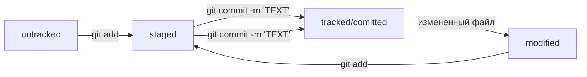

# Все что помню про GitHub

## Так заголовок  
git add . - добавляет все файлы в коммит  
git commit -m 'Текст коммита'  
git push загрузка коммита  
### Ссылка на учебник  
[Ссылка на шпаргалку](https://gist.github.com/fomvasss/8dd8cd7f88c67a4e3727f9d39224a84c#headers)  

##### В первый раз эту команду нужно вызвать с флагом -u и параметрами origin (имя удалённого репозитория) и main или master (название текущей ветки). Флаг -u свяжет локальную ветку с одноимённой удалённой. Как вы связывали локальный и удалённый репозитории в предыдущем уроке, так же и здесь нужно дополнительно связать ветки.  
$ git push -u origin main/master

## Хеш — идентификатор коммита  
#### $ git log вызов Хеша коммитов  
Хеш содержит:
1. строка из цифр и латинских букв после слова commit — это хеш коммита;
2. Author — имя автора и его электронная почта;
3. Date — дата и время создания коммита;
4. в конце находится сообщение коммита.  

#### git log --oneline :Получить сокращённый лог коммита  

## HEAD  
HEAD указывает на коммит сделанный последним

